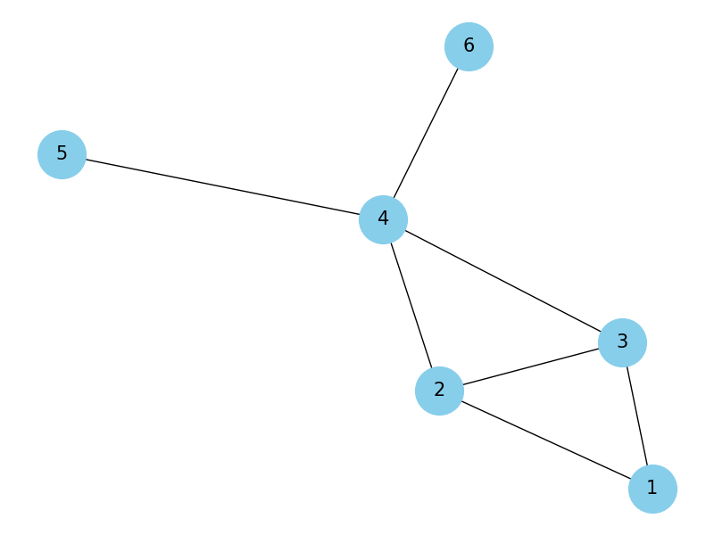

# goit-algo-hw-06

# Task 1
Запустивши код створюється граф з 6 вершинами та 7 ребрами, які представляють зв'язки між людьми у соціальній мережі. Візуалізація графу показана на графіку, а також виведені основні характеристики графу, такі як кількість вершин та ребер, а також ступінь кожної вершини.

### Кількість вершин у графі:
    6
### Кількість ребер у графі:
    7
### Ступінь кожної вершини:
    {1: 2, 2: 3, 3: 3, 4: 4, 5: 1, 6: 1}

# Task 2
### DFS шляхи від вершини 1 до 5:
    [[1, 2, 3, 4, 5], [1, 2, 4, 5], [1, 3, 2, 4, 5], [1, 3, 4, 5]]

### BFS шляхи від вершини 1 до 5:
    [[1, 2, 4, 5], [1, 3, 4, 5], [1, 2, 3, 4, 5], [1, 3, 2, 4, 5]]

Можна помітити, що DFS і BFS знаходять різні шляхи від вершини 1 до вершини 5.

DFS розглядає всі можливі гілки графу, перш ніж переходити до наступної гілки. Тому результатом є різні комбінації шляхів, що можуть бути знайдені в різних порядках.

BFS, натомість, обробляє всі сусідні вершини одного рівня перед переходом до наступного рівня, що призводить до того, що він знаходить найдовший шлях від початкової вершини до цільової.

# Task 3
### Підсумкова таблиця найкоротших шляхів від кожної вершини до всіх інших вершин у графі:

| Вершина | Найкоротші шляхи |
|---------|------------------|
| 1       | {1: 0, 2: 1, 3: 1, 4: 2, 5: 3, 6: 3} |
| 2       | {1: 1, 2: 0, 3: 1, 4: 1, 5: 2, 6: 2} |
| 3       | {1: 1, 2: 1, 3: 0, 4: 1, 5: 2, 6: 2} |
| 4       | {1: 2, 2: 1, 3: 1, 4: 0, 5: 1, 6: 1} |
| 5       | {1: 3, 2: 2, 3: 2, 4: 1, 5: 0, 6: 2} |
| 6       | {1: 3, 2: 2, 3: 2, 4: 1, 5: 2, 6: 0} |
